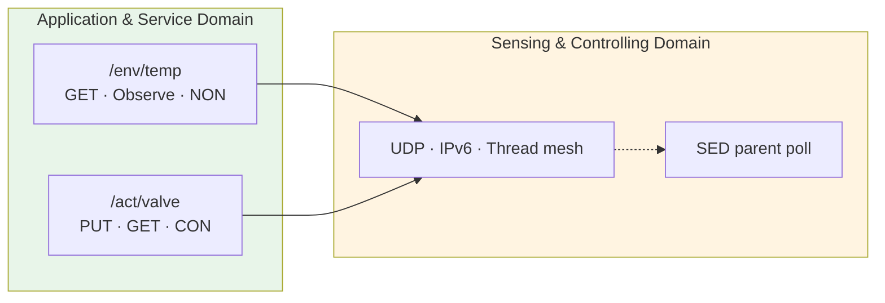

# Lab 3: CoAP — Reading Sensors and Commanding Valves

**GreenField Technologies — SoilSense Project** · Phase: Application layer · 3 hours

**From:** Daniela (pilot farmer), forwarded by Edwin (Field Operations)
**Subject:** Two complaints from the pilot

> 1. *"The Wi-Fi prototype's batteries died in 4 days, and the dashboard takes forever
>    to update."*
> 2. *"The 'open valve' command went out at 06:00. The valve didn't move until 06:14, and
>    nobody could tell me whether it had received the command at all."*
>
> The mesh from Lab 2 works. Now the application on top of it has to be cheap on the
> radio, push readings when they change, and deliver valve commands with proof.
>
> — Edwin

| Stakeholder | Their question | How this lab answers |
|---|---|---|
| **Daniela (farmer)** | Why do batteries die, and why is the dashboard stale? | Part 3: one UDP datagram per reading, pushed on change with Observe. |
| **Edwin (Ops)** | How do I command a valve and *know* it moved? | Part 4: CON requests are acknowledged or retried, and fail loudly. |
| **Samuel (architect)** | Which delivery mode for which message, and what does a sleeping valve cost? | Parts 4–5: CON vs NON, and latency vs poll period. |
| **ISO 30141 auditor** | Are the data interfaces documented? | Part 2: two published API contracts. |

Unfamiliar terms (CON, NON, Observe, CBOR, Content-Format…) are in the
[glossary](../glossary.md). Done early? [SOP-03](sops/sop03_coap_basic.md) tours the
firmware and has extension experiments.

---

## Background: the same API as Lab 0, without the overhead

In Lab 0 your board served `GET /api/sensor` and `/api/control` over HTTP on Wi-Fi.
**CoAP** (RFC 7252) keeps that model, resources with URIs and methods, and changes
what goes on the air:

| | HTTP (Lab 0) | CoAP (today) |
|---|---|---|
| Transport | TCP: handshake, then request, then teardown | **UDP**: one datagram each way |
| Header | text, often hundreds of bytes | **4 bytes** + options |
| Payload | JSON text | **CBOR**: the same data model, binary |
| Reliability | always (TCP) | **per message**: CON (acknowledged) or NON (fire and forget) |
| Push | the client polls | **Observe**: register once, the server pushes on change |

The firmware gives every board both sides: a **CoAP server** with two resources, and the
**OpenThread CoAP client** in the shell (`ot coap …`).

## Part 1 — Setup

**Per pair:** 2 boards. **S** is the field node (temperature sensor + valve), **C** is the
client standing in for the gateway. A third board is optional.

**Task 1.1** — flash [`firmware/lab3_coap`](../../firmware/lab3_coap) to both boards, same
commands as Lab 2 (Super Mini: add the USB console options from Lab 1):

```bash
source ~/zephyrproject/env.sh
cd firmware/lab3_coap

west build -p always -b esp32c6_devkitc/esp32c6/hpcore .
west flash
west espressif monitor -p /dev/ttyUSB0
```

**Task 1.2** — form the network with **C as the leader** (Part 5 makes S a sleepy child
of C), exactly as in Lab 2: `ot factoryreset` on both, `ot dataset init new` → `commit
active` → `ifconfig up` → `thread start` on C, then paste C's `ot dataset active -x` on S.

**Task 1.3** — make C the client. OpenThread then keeps CoAP traffic on C for its own
client, and S's server answers:

```bash
# C:
uart:~$ ot coap start
# S: note its address
uart:~$ ot ipaddr mleid
fdde:ad00:beef:0:6a1b:3c4d:9e2f:1a07
```

Never run `ot coap start` on S: it would take port 5683 away from S's server.

## Part 2 — The API contracts

These two tables are the artifacts you cite in your ADRs and DDR §4. The firmware
produces exactly this; if you change the firmware, change the contract first.

### `/env/temp` — air temperature

| | |
|---|---|
| **Methods** | `GET`, `GET` + Observe (RFC 7641) |
| **Content-Format** | `60` (`application/cbor`) |
| **Payload** | `{"t": float16}`, °C, always 6 bytes |
| **Max-Age** | 60 s |
| **Observe policy** | NON notification when the value moved > 0.5 °C since the last one; CON heartbeat after 45 s without one |

```
A1            map, 1 pair
61 74         text, 1 byte: "t"
F9 hh ll      half-precision float (IEEE 754), big-endian
```

| `t` (°C) | Wire bytes |
|---|---|
| 0.0 | `A1 61 74 F9 00 00` |
| 24.5 | `A1 61 74 F9 4E 20` |
| 25.0 | `A1 61 74 F9 4E 40` |
| −10.0 | `A1 61 74 F9 C9 00` |

### `/act/valve` — irrigation valve

| | |
|---|---|
| **Methods** | `PUT` (set), `GET` (read) |
| **Request payload** | CBOR `{"v": 0 \| 1}` with Content-Format 60, or the text `0` / `1` with no Content-Format (the OpenThread shell can only send text) |
| **Response payload** | the valve state as CBOR `{"v": 0 \| 1}`, Content-Format 60 |
| **Codes** | `2.04 Changed` after PUT · `2.05 Content` after GET · `4.00 Bad Request` for any other payload |
| **Idempotent** | yes: the same PUT twice leaves the same state |

```
A1 61 76 00   {"v": 0}  closed
A1 61 76 01   {"v": 1}  open
```

**CDDL** (RFC 8610, the schema language for CBOR):

```
env-reading = { t: float16 }        ; °C
valve-state = { v: 0 / 1 }          ; 0 = closed, 1 = open
```

## Part 3 — Uplink: readings that cost one datagram

**Task 3.1** — read the temperature once, from C:

```bash
uart:~$ ot coap get <S-mleid> env/temp
coap response from fdde:ad00:beef:0:6a1b:3c4d:9e2f:1a07 with payload: a16174f94e2a
```

S logs the other side, including the sizes you need for Part 6:

```
<inf> env_temp: GET /env/temp from fdde:...: 2.05, 24.66 C, CoAP 17 B (CBOR a16174f94e2a), request 15 B
```

Decode the 6 bytes by hand against the contract, then check with [cbor.me](https://cbor.me).

**Task 3.2** — Observe instead of polling. Register for 5 minutes, then cancel:

```bash
uart:~$ ot coap observe <S-mleid> env/temp
coap response from fdde:... OBS=3 with payload: a16174f94e43
...
uart:~$ ot coap cancel
```

S logs every notification with its reason and running counters:

```
<inf> env_temp: notify (threshold, NON): T=25.04 C, delta=0.52 C, 6s since last [threshold 7, heartbeat 1]
```

| Window | Notifications (threshold) | Notifications (heartbeat) | GETs a 1 Hz poller would have sent | Ratio |
|---|---|---|---|---|
| 5 min | | | 300 | |

The simulated sensor swings ±1 °C over 60 s. Heartbeats are sent as **CON**: if C has
vanished, the retries fail and S drops the registration.

## Part 4 — Downlink: commands with proof

**Task 4.1** — open and close the valve with CON requests. S's LED turns **white** while
the valve is open:

```bash
uart:~$ ot coap put <S-mleid> act/valve con 1
coap response from fdde:... with payload: a1617601
uart:~$ ot coap get <S-mleid> act/valve
coap response from fdde:... with payload: a1617601
uart:~$ ot coap put <S-mleid> act/valve con 0
coap response from fdde:... with payload: a1617600
```

Send `con 1` twice in a row and read S's log: the second PUT reports `OPEN, no change`.
That's idempotency, and Task 5.3 shows why it matters. Then send a bad payload
(`con 7`) and check S's log for the 4.00.

**Task 4.2** — CON vs NON under loss. Make S disappear (`ot thread stop` on S), then:

1. On C: `ot coap put <S-mleid> act/valve con 1` and start a stopwatch. C retransmits on
   its own; eventually it prints `coap receive response error 28: ResponseTimeout`.
   Record the time.
2. Repeat with `non-con` instead of `con`. Wait two minutes. What does C print?
3. `ot thread start` on S, wait for it to rejoin, and send the CON PUT again.

Predict the timeout before you measure: the first wait is random in 2–3 s and doubles
after each of the 4 retransmissions.

## Part 5 — A valve that sleeps

A battery valve can't keep its receiver on like a router. As a **sleepy end device
(SED)** it turns the radio off and wakes every *poll period* to ask its parent "any mail
for me?". Until then, the parent holds the message.

**Task 5.1** — make S sleepy, polling every second:

```bash
# S:
uart:~$ ot mode -                    # rx-off-when-idle, minimal device
uart:~$ ot pollperiod 1000           # milliseconds
uart:~$ ot state                     # child (LED yellow); C is its parent
```

**Task 5.2** — measure the downlink latency from C with pings, at three poll periods (set
each on S with `ot pollperiod`). The timeout must be longer than the poll period:

```bash
uart:~$ ot ping <S-mleid> 16 10 1.3 64 40
```

| Poll period | RTT min / avg / max (ms) | Radio-on fraction for polling (estimate) |
|---|---|---|
| 1 s | | |
| 5 s | | |
| 15 s | | |

**Task 5.3** — at a 5 s poll period, open the valve (`con 1`) and watch S's log. How many
times does the PUT arrive, and why? (Compare CoAP's first retransmission time with the
poll period.)

Restore S when you're done: `ot mode rdn`, then `ot pollperiod 0`.

## Part 6 — The byte budget

Fill in the CoAP rows from S's logs (Task 3.1 and Task 4.1):

| Exchange | Request | Response | Packets | Notes |
|---|---|---|---|---|
| HTTP/JSON reading (Lab 0) | ~150 B + TCP | ~120 B + TCP | 7+ | handshake, GET, 200 OK, teardown |
| MQTT/JSON reading (Lab 0) | — | ~40 B | 1 | on a TCP connection kept open with keepalives |
| CoAP GET `/env/temp` | ____ B | ____ B | 2 | |
| CoAP Observe notification | — | ____ B | 1 | |
| CoAP PUT `/act/valve` (CON) | ____ B | ____ B | 2 | |

Add UDP (8 B) and the compressed IPv6 header (Lab 2) and check that every CoAP message
fits in a single 802.15.4 frame.

## Part 7 — The "why" questions (DDR Section 5)

1. **Why can CoAP use UDP where HTTP needs TCP?** What does CON give back, and what does
   NON deliberately give up?
2. **Why does Observe save battery compared with `GET` every 60 s?** Who knows when the
   value changed, and who pays for the radio?
3. **Why did the SED receive the same PUT twice in Task 5.3, and why was that harmless?**
   What would have happened with a "toggle valve" command?
4. **Why CBOR and not a hand-made binary struct?** (Key terms: self-describing, schema
   evolution, CDDL.)

## ISO/IEC 30141 mapping

Mostly **ASD**: the URIs, methods, CBOR contracts and the Observe/CON interaction
patterns are the service the rest of the system consumes. The mesh and UDP underneath
stay in the **SCD**, and so does the SED parent-poll mechanism: it belongs to the
device's communication subsystem, not to the application.



CoAP sits on the **functional plane**; Thread MLE (Lab 2) keeps the mesh and the SED's
parent link alive on the **management plane**. Either can change without touching the
other.

## Deliverables

1. **DDR update:**
   - Section 3: **ADR-003** (CoAP + CBOR for uplink and downlink, citing your Part 6
     numbers and why MQTT wasn't chosen for the radio side) and **ADR-004** (the poll
     period for battery valves, citing Task 5.2 and your energy estimate).
   - Section 4: both API contracts and the CDDL as ASD entries.
   - Section 5: the "why" answers.
   - Section 6: GET round-trip time over one hop, CON timeout, latency per poll period.
2. **Energy estimate** for a sleepy valve: take the radio RX and sleep currents from the
   ESP32-C6 datasheet (cite the table), assume each poll keeps the radio on ~10 ms, and
   compute the average current and the 2× AA battery life at your chosen poll period.
3. **Summary for Edwin** (three lines): how a command is confirmed, what happens when the
   valve is unreachable, and the latency his crew should expect.
4. **Safety design** (DDR Section 7): the valve receives OPEN, then the network dies
   before CLOSE. What should the valve do on its own, and after how long?

## Grading (100 pts)

| | pts |
|---|---|
| **Technical execution** — GET + decode against the contract (8) · Observe counts and ratio (8) · valve PUT/GET + idempotency (8) · CON timeout and NON comparison (8) · SED latency table (8) | 40 |
| **ISO/IEC 30141** — both API contracts + CDDL (15) · ASD/SCD split explained (10) · ADR format (5) | 30 |
| **First principles** — Q1 (5) · Q2 (5) · Q3 (5) · Q4 (5) | 20 |
| **Communication** — Edwin summary (5) · energy estimate (5) | 10 |
| **Ethics (pass/fail)** — safety design for a lost CLOSE; poll period justified by a stakeholder need, not by "it felt snappy" | ✓ |

## Resources & next week

RFC 7252 (CoAP) · RFC 7641 (Observe) · RFC 8949 (CBOR) · RFC 8610 (CDDL) ·
[OpenThread CLI: coap](https://openthread.io/reference/cli/commands#coap) ·
[Zephyr CoAP server](https://docs.zephyrproject.org/latest/connectivity/networking/api/coap_server.html) ·
[cbor.me](https://cbor.me)

**Lab 4:** the simulated temperature goes away. You'll read real sensors and serve them
through the same contracts.
